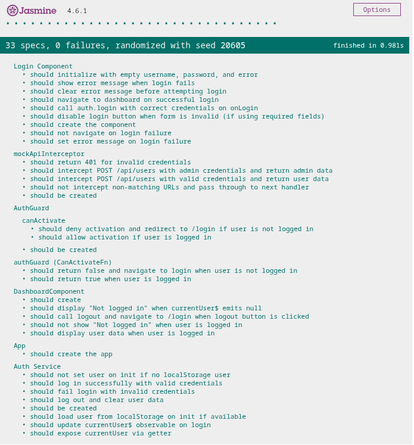

# JwtAuthenticationAngular

A simple JWT authentication example using angular

## How to run it

### Prerequisites

Have docker installed

### Preparing docker container

Run this command

```Bash
docker compose up -d
```

### Open in browser

[link to open app in browser](http://localhost:4200)

## Demo video

[demo video link](docs/demo.webm)

## Tests



## Angular

[Angular instructions](docs/angular.md)
